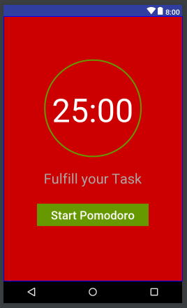

# Reto1_Mobile_Pomodoro
Reto 1 - Desarrollo Mobile - Core Upgrade
La aplicación "Pomodoro" es una herramienta que ayuda a controlar los tiempos de trabajo y de descanso, necesarios para cualquier actividad de estudio o para desarrolladores. Consiste en 25 minutos de trabajo o "pomodoro" y a continuación un tiempo de descanso de 5 minutos, luego del cuarto "pomodoro", el descanso es de 10 minutos.
Para esta aplicación usé la clase de Android CountDownTimer y MediaPlayer, así también RingProgressBar una libreria externa en github.

